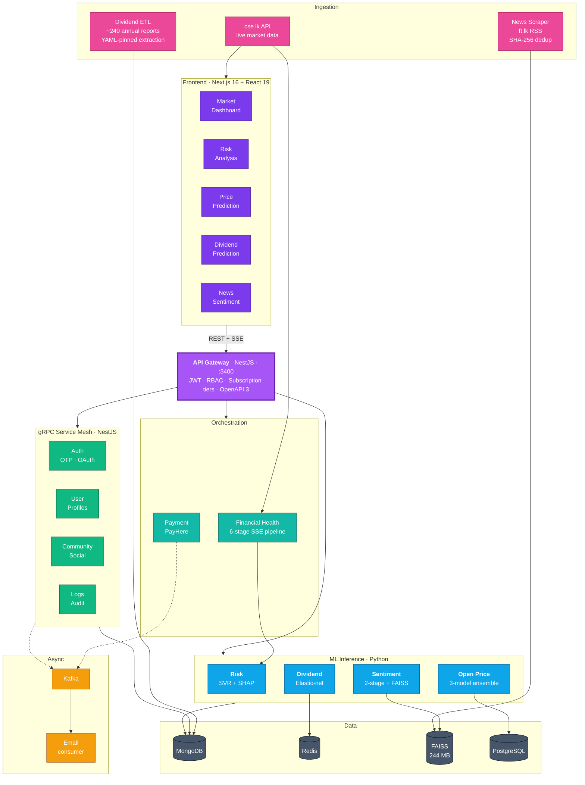
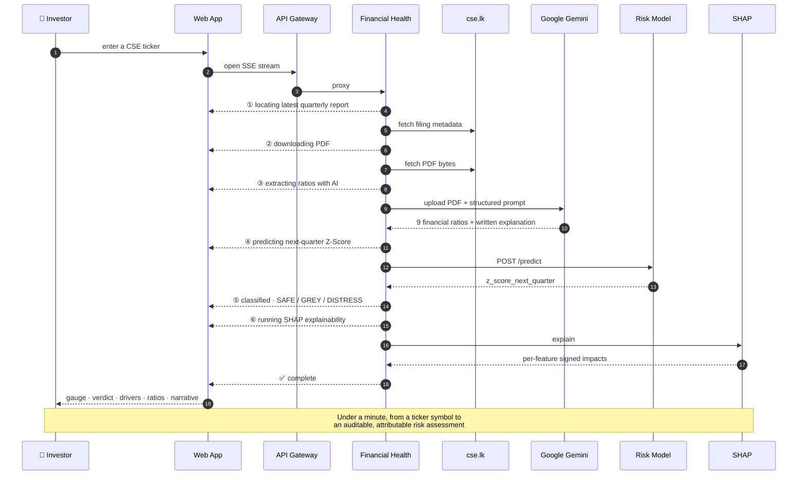

<!--
═══════════════════════════════════════════════════════════════════════════════
  ORGANIZATION PROFILE README
  ─────────────────────────────────────────────────────────────────────────────
  To publish this as the Research-SLIIT organization landing page:

    1.  Create a public repository in the org named exactly:  .github
    2.  Inside it, create a folder named:                     profile
    3.  Save this file as:                                    profile/README.md
    4.  Commit and push.

  GitHub then renders it at https://github.com/Research-SLIIT

  IMAGE / VIDEO PATHS
  ─────────────────────────────────────────────────────────────────────────────
  The asset links below are RELATIVE and resolve inside the .github repo.
  Create these folders there and drop your files in:

      .github/profile/assets/screenshots/
      .github/profile/assets/videos/

  Alternatively, point the links at the raw URLs of the images already
  committed in the Backend / Frontend repos, e.g.

      https://raw.githubusercontent.com/Research-SLIIT/Final-Year-Research_CSE-25-26J-445-Frontend/dev/docs/screenshots/01-dashboard.png

  MP4 files cannot be embedded with markdown image syntax. Either commit an
  animated GIF, or drag the MP4 into any GitHub issue comment, copy the
  generated user-content URL, and paste that bare URL on its own line — GitHub
  renders it as an inline video player.
═══════════════════════════════════════════════════════════════════════════════
-->

<div align="center">


# InvestWise

### Explainable Machine Intelligence for the Colombo Stock Exchange

**Final Year Research Project · CSE-25-26J-445**
*Sri Lanka Institute of Information Technology — Faculty of Computing · 2025/26*

<p>


</p>

<p>


</p>

**[▶ Watch the Demo](#-see-it-working)** · **[Research Components](#-four-research-components)** · **[Architecture](#-how-it-fits-together)** · **[Repositories](#-repositories)** · **[Team](#-the-team)**

</div>

---

## The problem we set out to solve

The Colombo Stock Exchange has roughly **280 listed companies** and almost no analytical tooling built for it. The instruments a retail investor in Colombo has access to are, in practice, a price chart and a PDF annual report.

That gap is not a lack of data — CSE filings, quarterly reports and financial news all exist publicly. It is a lack of **infrastructure to turn that data into decisions**, and it is compounded by three properties that make off-the-shelf models fail here:

<table>
<tr>
<td width="33%" valign="top">

### 📄 Unstructured filings
Sri Lankan annual reports have no consistent layout. Two companies in the same sector will put the same metric in different places, in different formats, in the same year. Generic PDF parsers extract garbage.

</td>
<td width="33%" valign="top">

### 📉 Small, sparse datasets
Only a minority of listed companies publish machine-extractable reports consistently across a decade. Models trained on thousands of US filings do not transfer to a corpus of a few hundred rows.

</td>
<td width="33%" valign="top">

### 🇱🇰 Local-language signals
Market-moving news mixes English with Sinhala and Tamil transliterations, local company nicknames, and regulatory vocabulary specific to the CSE and the Central Bank.

</td>
</tr>
</table>

**Our position:** a prediction an investor cannot interrogate is not usable. So every model in this project ships with its reasoning exposed — SHAP attributions, printed decision trees with real fusion weights, KaTeX-rendered feature derivations, and retrieved historical precedents. **Explainability is the deliverable, not a feature.**

---

## 🎬 See It Working

<div align="center">

### Full product walkthrough

<!--
  Replace with a GIF, or with a GitHub user-content video URL on its own line.
-->


*Sign-in → live market dashboard → all four ML components exercised end to end*

</div>

<table>
<tr>
<td width="25%" align="center">

**🩺 Risk Analysis**

<a href="profile/assets/videos/demo-risk-analysis.gif"></a>

A 6-stage AI pipeline narrating itself over SSE, then a Z-Score verdict with SHAP drivers

</td>
<td width="25%" align="center">

**📈 Price Forecast**

<a href="profile/assets/videos/demo-price-prediction.gif"></a>

T+5 open-price forecast from a 3-model ensemble with feature importance

</td>
<td width="25%" align="center">

**💰 Dividend Risk**

<a href="profile/assets/videos/demo-dividend.gif"></a>

Cut probability with all 14 engineered features and their KaTeX formulas

</td>
<td width="25%" align="center">

**📰 News Impact**

<a href="profile/assets/videos/demo-news-sentiment.gif"></a>

Two-stage cascade printing its own decision tree and historical precedents

</td>
</tr>
</table>

### Product screenshots

<div align="center">


**Live market dashboard** — ASPI · S&P SL20 · all-sector performance · gainers and losers · CSE news, pulled live from `cse.lk`

</div>

<table>
<tr>
<td width="50%" align="center">
<br>
<sub><b>Projected next-quarter Altman Z-Score</b> with Safe/Grey/Distress classification</sub>
</td>
<td width="50%" align="center">
<br>
<sub><b>SHAP attribution</b> — which ratios drove the score, and by how much</sub>
</td>
</tr>
<tr>
<td width="50%" align="center">
<br>
<sub><b>T+5 ensemble forecast</b> with per-day deltas and confidence</sub>
</td>
<td width="50%" align="center">
<br>
<sub><b>Dividend cut probability</b> against a tuned 0.822 threshold</sub>
</td>
</tr>
<tr>
<td width="50%" align="center">
<br>
<sub><b>The model's actual decision tree</b> — stage scores, thresholds, fusion weights</sub>
</td>
<td width="50%" align="center">
<br>
<sub><b>Every engineered feature</b> documented with its rendered formula</sub>
</td>
</tr>
<tr>
<td width="50%" align="center">
<br>
<sub><b>OpenAPI documentation</b> — nine endpoint groups behind one gateway</sub>
</td>
<td width="50%" align="center">
<br>
<sub><b>14 containers</b> across two Docker Compose profiles</sub>
</td>
</tr>
</table>

---

## 🔬 Four Research Components

Four members, four independently trained and independently evaluated models, one shared platform.

<table>
<tr>
<th width="4%"></th>
<th width="22%">Component</th>
<th width="30%">Method</th>
<th width="22%">Key result</th>
<th width="22%">What makes it hard</th>
</tr>

<tr>
<td align="center">🩺</td>
<td>

**Financial Distress Prediction**

</td>
<td>

Support Vector Regression projecting next-quarter **Altman Z-Score** from 9 ratios, explained with a SHAP `KernelExplainer`

</td>
<td>

Safe / Grey / Distress classification with **per-feature signed attribution**; artifacts hot-swappable without restart

</td>
<td>

Ratios must be extracted from unstructured quarterly PDFs — solved by sending them straight to Gemini's File API instead of parsing

</td>
</tr>

<tr>
<td align="center">📈</td>
<td>

**Open Price Forecasting**

</td>
<td>

Equal-weight ensemble of **LightGBM + XGBoost + CatBoost** over 28 engineered technical features, 60-day lookback

</td>
<td>

T+5 open-price path with SHAP feature importance; outlier log-returns clamped at ±0.15

</td>
<td>

CSE liquidity is thin and volatility is regime-dependent — a single model overfits, so three disagree and average

</td>
</tr>

<tr>
<td align="center">💰</td>
<td>

**Dividend Cut Prediction**

</td>
<td>

Elastic-net **Logistic Regression** on 14 features engineered from 8 raw balance-sheet fields, including lagged terms

</td>
<td>

**82.1 % test accuracy**, AUC 0.697, decision threshold tuned to **0.822**, minority class weighted 3×

</td>
<td>

Only ~19 companies publish extractable reports across 2012–2025 — 140 training samples, built by a bespoke YAML-driven ETL over ~240 annual reports

</td>
</tr>

<tr>
<td align="center">📰</td>
<td>

**News Market-Impact & Sentiment**

</td>
<td>

**Two-stage XGBoost** cascade over 3072-d OpenAI embeddings, fused with a financial lexicon, grounded by **FAISS** retrieval

</td>
<td>

Market-moving flag + direction + a 4-step decision tree with real fusion weights + retrieved historical precedents

</td>
<td>

Most news is irrelevant, so a spaCy + RapidFuzz **company gate** runs before any paid inference; the cascade exits early twice

</td>
</tr>
</table>

<details>
<summary><b>📐 Model specifications in detail</b></summary>

| | Risk | Open Price | Dividend | Sentiment |
|---|---|---|---|---|
| **Algorithm** | SVR | LightGBM + XGBoost + CatBoost | Logistic Regression | XGBoost ×2 + lexicon |
| **Preprocessing** | StandardScaler | 28-feature engineering | 14-feature engineering | `text-embedding-3-large` (3072-d) |
| **Target** | Next-quarter Z-Score | T+5 open price | P(dividend cut) | Impact + direction |
| **Key hyperparameters** | — | equal-weight ensemble | `C=0.05`, `l1_ratio=0.2`, `saga`, `class_weight {0:1, 1:3}`, `max_iter=20000` | Stage 1 threshold `0.30`; fusion `0.6/0.4` when `lex_conf ≥ 0.60`, else `0.7/0.3` |
| **Validation** | — | held-out test set | **temporal split**, train cutoff 2021 | held-out + lexicon cross-check |
| **Reported metrics** | — | — | acc **0.8214**, AUC **0.6974**, n=140 | — |
| **Explainability** | SHAP KernelExplainer + k-means background (k=10) | SHAP feature importance | KaTeX-documented feature derivations + LLM narrative | printed decision tree + FAISS precedents |
| **Serving** | Flask · `:5001` | FastAPI · `:5002` | FastAPI · `:8001` | FastAPI · `:8002` |

</details>

---

## 🏗 How It Fits Together

Four research tracks share one ingestion layer, one auth boundary, and one API contract. That separation is what let them be developed in parallel — and is itself an engineering contribution of the project.



### The showcase pipeline

The financial-health analysis is the clearest illustration of how the pieces compose — a single ticker triggers six stages across four systems, streamed to the browser as it happens:



---

## 📦 Repositories

<table>
<tr>
<th width="26%">Repository</th>
<th width="44%">Contents</th>
<th width="30%">Stack</th>
</tr>

<tr>
<td valign="top">

### [⚙️ Backend](https://github.com/Research-SLIIT/Final-Year-Research_CSE-25-26J-445-Backend)

`dev-deploy`

[](https://github.com/Research-SLIIT/Final-Year-Research_CSE-25-26J-445-Backend#readme)

</td>
<td valign="top">

An **Nx monorepo of 13 applications**: a REST API gateway, four gRPC microservices, a Kafka email consumer, PayHere billing, an SSE orchestration service, **four Python ML inference services**, and the YAML-driven annual-report ETL.

Two Docker Compose profiles — 9 containers for core development, 14 for the full platform. Health checks on every service, CI/CD to EC2.

Documented with **19 architecture diagrams**, complete API reference, model specifications and sequence diagrams.

</td>
<td valign="top">

`NestJS 11` `TypeScript 5.9`
`Nx 21.5` `Python 3.11`
`FastAPI` `Flask 3.0`
`gRPC` `Apache Kafka 7.5`
`MongoDB 7` `Redis 7.2`
`PostgreSQL` `FAISS`
`XGBoost` `LightGBM`
`CatBoost` `scikit-learn`
`SHAP` `spaCy`
`Docker Compose`
`GitHub Actions` `AWS EC2`

</td>
</tr>

<tr>
<td valign="top">

### [🖥️ Frontend](https://github.com/Research-SLIIT/Final-Year-Research_CSE-25-26J-445-Frontend)

`dev`

[](https://github.com/Research-SLIIT/Final-Year-Research_CSE-25-26J-445-Frontend#readme)

</td>
<td valign="top">

A **Next.js 16 App Router** analytics dashboard. Live market data via server-side CORS proxies, SSE-streamed AI pipelines, SHAP visualisations, KaTeX-documented feature engineering, and printed model decision trees.

58 shadcn/ui primitives, 35 domain and feature components, 5 Zustand stores, 7 hooks, **40 Vitest test files** scoped to the layers that render model output.

Full light/dark parity and mobile-first responsive layout throughout.

</td>
<td valign="top">

`Next.js 16` `React 19`
`TypeScript 5`
`Tailwind CSS 4.1`
`shadcn/ui` `Radix UI`
`Zustand 5` `Recharts`
`Framer Motion` `KaTeX`
`React Hook Form` `Zod`
`Vitest` `Testing Library`

</td>
</tr>
</table>

---

## 📊 By The Numbers

<table>
<tr>
<td align="center" width="16.6%"><h2>13</h2><sub>Applications in the<br/>Nx monorepo</sub></td>
<td align="center" width="16.6%"><h2>7</h2><sub>Trained models<br/>in production paths</sub></td>
<td align="center" width="16.6%"><h2>80</h2><sub>REST endpoints<br/>behind one gateway</sub></td>
<td align="center" width="16.6%"><h2>62</h2><sub>Test files<br/>across both repos</sub></td>
<td align="center" width="16.6%"><h2>14</h2><sub>Docker containers<br/>in the full stack</sub></td>
<td align="center" width="16.6%"><h2>~240</h2><sub>Annual reports<br/>in the ETL corpus</sub></td>
</tr>
</table>

| Dimension | Detail |
|---|---|
| **Architecture** | Microservices · event-driven · gRPC mesh · API gateway · SSE streaming |
| **Transports** | gRPC (internal, typed) · HTTP/JSON (polyglot ML boundary) · Kafka (async side effects) · SSE (long-running progress) |
| **ML breadth** | Regression · classification · ensembling · embeddings · vector retrieval · SHAP explainability |
| **Data sources** | CSE annual reports (PDF) · CSE quarterly filings (PDF) · `cse.lk` market API · `ft.lk` RSS news · Supabase OHLCV |
| **Vector store** | 244 MB FAISS index · 3072-dimensional · direction-filtered retrieval |
| **Explainability** | SHAP attributions · printed decision trees with real weights · KaTeX feature derivations · retrieved historical precedents |
| **Production concerns** | JWT + RBAC + subscription tiers · MD5-verified payment IPN · health checks on every container · CI/CD to EC2 · graceful degradation without LLM keys |

---

## 🧭 Engineering Decisions Worth Defending

Six choices that shaped the system, and the reasoning behind each.

<table>
<tr><th width="30%">Decision</th><th width="70%">Why</th></tr>

<tr><td>

**Four transports, not one**

</td><td>

gRPC for the internal NestJS mesh — protobuf contracts make refactors safe and framing is cheap. HTTP/JSON at the Python boundary — an ML service shouldn't need a gRPC toolchain to be independently testable with `curl`. Kafka for email — a sign-up must never get slower or fail because SMTP is down. SSE for long-running analysis — turns a 40-second wait into visible progress with no WebSocket infrastructure.

</td></tr>

<tr><td>

**Send PDFs to Gemini instead of parsing them**

</td><td>

Sri Lankan filings have no stable layout, so a parser is a permanent maintenance burden with a low ceiling. Gemini's File API accepts the raw PDF and returns both the extracted ratios *and* a written explanation in a single call. This removed an entire class of brittle code from the risk pipeline.

</td></tr>

<tr><td>

**A company gate before any inference**

</td><td>

Most items on a news firehose mention no listed company. Running spaCy + RapidFuzz against the CSE mapping *first* means irrelevant text never costs an embedding API call. Stage 1 then filters again before Stage 2 runs. The cascade is a cost-control structure as much as a classifier.

</td></tr>

<tr><td>

**Two independent sentiment signals, fused by confidence**

</td><td>

The lexicon is precise but brittle; the embedding model is general but opaque. Letting the lexicon lead *only when it is confident* (≥ 0.60) captures cases where explicit financial vocabulary beats semantic similarity, and lets the model lead everywhere else. Neither signal alone was good enough.

</td></tr>

<tr><td>

**A dividend threshold of 0.822, not 0.5**

</td><td>

With 140 samples and a minority positive class, the default threshold produced too many false cut alarms to be usable. Tuning to 0.822 and weighting the minority class 3× trades recall for the precision the use case actually needs — an investor ignores a tool that cries wolf. The temporal train/test split at 2021 guarantees no lookahead leakage.

</td></tr>

<tr><td>

**Labelled demo mode instead of a 503**

</td><td>

The sentiment models are bound to `text-embedding-3-large`'s 3072-d space, so without an OpenAI key there is no honest inference. Rather than fail closed, the service serves a response with every substituted stage explicitly marked (`demo_mode`, `demo_notice`, fusion weights reported as `{ML: 0.0, Lexicon: 1.0}`). The full pipeline stays demonstrable and a demo result can never be mistaken for a real one.

</td></tr>
</table>

---

## 🚀 Run It Yourself

```bash
# 1 · Backend — full stack including all ML services
git clone https://github.com/Research-SLIIT/Final-Year-Research_CSE-25-26J-445-Backend.git
cd Final-Year-Research_CSE-25-26J-445-Backend && git checkout dev-deploy
cp .env.example .env                       # fill in your values
docker compose --profile ml up -d          # 14 containers

# 2 · Frontend
git clone https://github.com/Research-SLIIT/Final-Year-Research_CSE-25-26J-445-Frontend.git
cd Final-Year-Research_CSE-25-26J-445-Frontend && git checkout dev
pnpm install && pnpm dev                   # → http://localhost:3000
```

| Interface | URL |
|---|---|
| **Web application** | <http://localhost:3000> |
| **API Gateway · Swagger UI** | <http://localhost:3400/api/v1> |

> [!TIP]
> Allocate **≈ 11–12 GB of RAM to Docker** before the first `--profile ml` run. The ML profile loads XGBoost boosters, a 3-model gradient-boosting ensemble and a 244 MB FAISS index simultaneously; below that the Python containers are OOM-killed during startup and report as unhealthy with no obvious error.
>
> The stack starts **without any LLM API keys** — the dividend and sentiment services fall back to clearly labelled demo modes, and every non-LLM path (risk prediction, SHAP, price forecasting, auth, community, payments) works fully.

Complete setup instructions, environment reference and troubleshooting live in each repository's README.

---

## 👥 The Team

**CSE-25-26J-445** · SLIIT Faculty of Computing · Academic Year 2025/26

<table>
<tr>
<th width="30%">Research Component</th>
<th width="38%">Backend Ownership</th>
<th width="32%">Frontend Ownership</th>
</tr>
<tr>
<td>🩺 <b>Financial Risk & Explainability</b></td>
<td><code>Risk-prediction-ml</code> · <code>financial-health-service</code></td>
<td><code>/risk</code> · Z-Score gauge · SHAP breakdown · SSE hook</td>
</tr>
<tr>
<td>📈 <b>Open Price Forecasting</b></td>
<td><code>open-price-prediction-ml</code></td>
<td><code>/predict</code> · forecast + delta charts</td>
</tr>
<tr>
<td>💰 <b>Dividend Cut Prediction</b></td>
<td><code>Dividend-prediction-ml</code> · <code>Dividend-ETL</code></td>
<td><code>/dividend</code> · feature cards · KaTeX explanations</td>
</tr>
<tr>
<td>📰 <b>News Sentiment & Market Impact</b></td>
<td><code>sentiment-backend</code></td>
<td><code>/news</code> · analyse box · AI terminal · decision tree</td>
</tr>
<tr>
<td>🏗 <b>Platform & Infrastructure</b></td>
<td><code>api-gateway</code> · <code>auth</code> · <code>user</code> · <code>community</code> · <code>email</code> · <code>payment</code> · <code>logs</code></td>
<td><code>AppShell</code> · auth store · <code>/admin</code> · <code>/pricing</code></td>
</tr>
</table>

*Supervised by the SLIIT Faculty of Computing.*

---

## 📄 License

Released under the **MIT License**.

Built for academic research. Nothing in this project constitutes financial advice — the models are research artifacts trained on limited data, and their limitations are documented in each repository.

---

<div align="center">

### Sri Lanka Institute of Information Technology
**Faculty of Computing** · Final Year Research Project · 2025/26

<sub>Colombo Stock Exchange · Explainable Machine Learning · Event-Driven Microservices</sub>

<br>

[](https://github.com/Research-SLIIT/Final-Year-Research_CSE-25-26J-445-Backend)
[](https://github.com/Research-SLIIT/Final-Year-Research_CSE-25-26J-445-Frontend)

</div>
