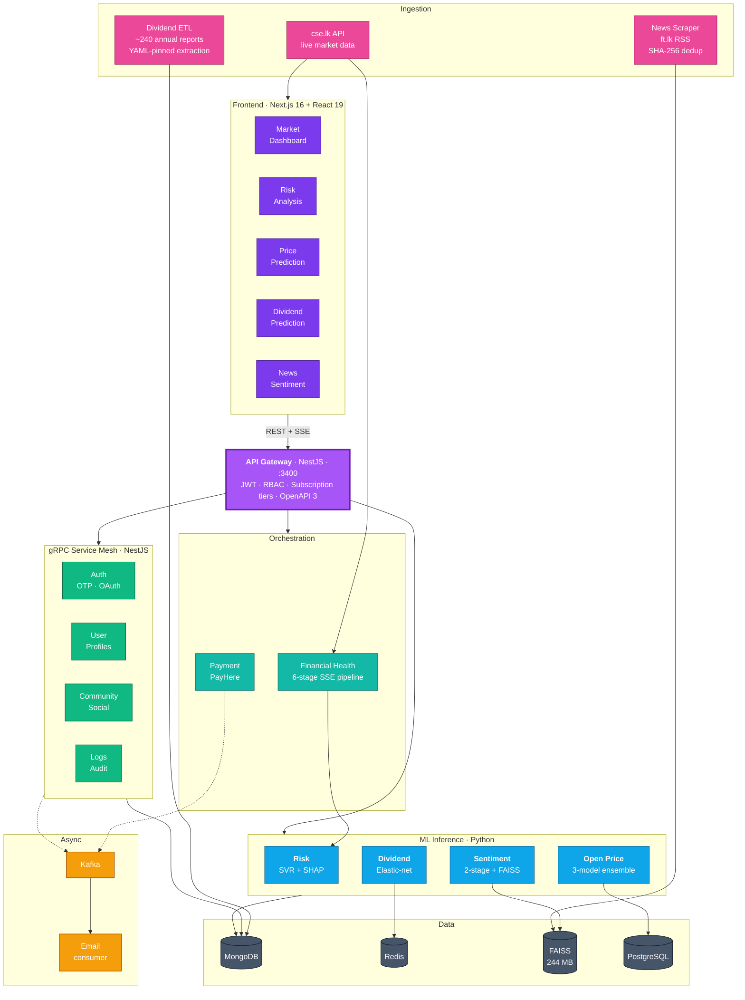

<!--
═══════════════════════════════════════════════════════════════════════════════
  ORGANIZATION PROFILE README  ·  Research-SLIIT

  To publish as the org landing page (https://github.com/Research-SLIIT):
    1. Create a PUBLIC repo in the org named exactly:  .github
    2. Save this file as:                              profile/README.md
    3. Commit and push.

  IMAGES: every asset below is an absolute raw.githubusercontent.com URL
  pointing at screenshots/GIFs already committed to the FRONTEND repo on the
  `dev` branch. Nothing needs to be copied into the .github repo, and the
  Frontend repo must stay PUBLIC or every image 404s.

  ⚠ The BACKEND repo is currently PRIVATE, so its raw URLs 404 for anonymous
  visitors — and so do the two "Backend Repository" badge links below. Two
  backend screenshots (Docker stack, Swagger) are therefore commented out
  inline, marked "BACKEND IMAGE". Once the backend repo is made public,
  re-enable them and delete the frontend cell that replaced each one.

  If a branch is renamed, update these bases:
    .../Final-Year-Research_CSE-25-26J-445-Frontend/dev/docs/...
    .../Final-Year-Research_CSE-25-26J-445-Backend/dev-deploy/docs/...
═══════════════════════════════════════════════════════════════════════════════
-->

<div align="center">


# InvestWise

### Explainable Machine Intelligence for the Colombo Stock Exchange

**Final Year Research Project · CSE-25-26J-445**
*Sri Lanka Institute of Information Technology — Faculty of Computing · 2025/26*

<br>

<p>


</p>

</div>

---

## 📦 Repositories

<table>
<tr>
<td width="50%" valign="top">

### [⚙️ Backend](https://github.com/Research-SLIIT/Final-Year-Research_CSE-25-26J-445-Backend) · `dev-deploy`

An **Nx monorepo of 13 applications**: REST API gateway, four gRPC microservices, Kafka email consumer, PayHere billing, an SSE orchestration service, **four Python ML inference services**, and the YAML-driven annual-report ETL. Two Docker Compose profiles — 9 containers for core dev, 14 for the full platform. CI/CD to EC2.

`NestJS 11` `TypeScript 5.9` `Nx 21.5` `Python 3.11` `FastAPI` `Flask` `gRPC` `Kafka 7.5` `MongoDB 7` `Redis` `PostgreSQL` `FAISS` `XGBoost` `LightGBM` `CatBoost` `SHAP` `spaCy` `Docker` `GitHub Actions`

</td>
<td width="50%" valign="top">

### [🖥️ Frontend](https://github.com/Research-SLIIT/Final-Year-Research_CSE-25-26J-445-Frontend) · `dev`

A **Next.js 16 App Router** analytics dashboard. Live market data via server-side CORS proxies, SSE-streamed AI pipelines, SHAP visualisations, KaTeX-documented feature engineering, printed model decision trees. 58 shadcn/ui primitives, 35 domain components, 5 Zustand stores, **40 Vitest test files**. Full light/dark parity, mobile-first.

`Next.js 16` `React 19` `TypeScript 5` `Tailwind CSS 4.1` `shadcn/ui` `Radix UI` `Zustand 5` `Recharts` `Framer Motion` `KaTeX` `React Hook Form` `Zod` `Vitest`

</td>
</tr>
</table>

<table>
<tr>
<td align="center" width="16.6%"><h3>13</h3><sub>Nx applications</sub></td>
<td align="center" width="16.6%"><h3>7</h3><sub>Trained models</sub></td>
<td align="center" width="16.6%"><h3>80</h3><sub>REST endpoints</sub></td>
<td align="center" width="16.6%"><h3>62</h3><sub>Test files</sub></td>
<td align="center" width="16.6%"><h3>14</h3><sub>Docker containers</sub></td>
<td align="center" width="16.6%"><h3>~240</h3><sub>Annual reports in ETL</sub></td>
</tr>
</table>

---

## The problem

The Colombo Stock Exchange has ~280 listed companies and almost no analytical tooling built for it. The data exists — filings, quarterly reports, financial news — but three properties break off-the-shelf models: Sri Lankan annual reports have **no consistent layout**, only a minority publish **machine-extractable reports** across a decade, and market-moving news mixes **English with Sinhala and Tamil** transliterations and local company nicknames.

**Our position:** a prediction an investor cannot interrogate is not usable. Every model here ships with its reasoning exposed — SHAP attributions, printed decision trees with real fusion weights, KaTeX feature derivations, retrieved historical precedents. **Explainability is the deliverable, not a feature.**

---

## 🎬 See It Working

<div align="center">


*Sign-in → live market dashboard → all four ML components exercised end to end*

</div>

<table>
<tr>
<td width="25%" align="center">
<br>
<b>🩺 Risk Analysis</b><br><sub>6-stage AI pipeline over SSE → Z-Score verdict with SHAP drivers</sub>
</td>
<td width="25%" align="center">
<br>
<b>📈 Price Forecast</b><br><sub>T+5 open price from a 3-model ensemble</sub>
</td>
<td width="25%" align="center">
<br>
<b>💰 Dividend Risk</b><br><sub>Cut probability with 14 features and their formulas</sub>
</td>
<td width="25%" align="center">
<br>
<b>📰 News Impact</b><br><sub>Two-stage cascade printing its own decision tree</sub>
</td>
</tr>
</table>

<div align="center">


**Live market dashboard** — ASPI · S&P SL20 · sector performance · gainers and losers · CSE news pulled live from `cse.lk`

</div>

<table>
<tr>
<td width="50%" align="center">
<br>
<sub><b>Projected next-quarter Altman Z-Score</b> — Safe / Grey / Distress</sub>
</td>
<td width="50%" align="center">
<br>
<sub><b>SHAP attribution</b> — which ratios drove the score, and by how much</sub>
</td>
</tr>
<tr>
<td width="50%" align="center">
<br>
<sub><b>T+5 ensemble forecast</b> with per-day deltas and confidence</sub>
</td>
<td width="50%" align="center">
<br>
<sub><b>Dividend cut probability</b> against a tuned 0.822 threshold</sub>
</td>
</tr>
<tr>
<td width="50%" align="center">
<br>
<sub><b>The model's actual decision tree</b> — stage scores, thresholds, fusion weights</sub>
</td>
<td width="50%" align="center">
<br>
<sub><b>The 6-stage pipeline narrating itself</b> over SSE, live in the browser</sub>
</td>
<!-- BACKEND IMAGE — re-enable once the Backend repo is public, then delete the cell above:
<td width="50%" align="center">
<br>
<sub><b>14 containers</b> across two Docker Compose profiles</sub>
</td>
-->
</tr>
</table>

<details>
<summary><b>More screenshots</b> — SHAP ratios · dividend features · AI narrative · Swagger · light mode · mobile</summary>
<br>
<table>
<tr>
<td width="33%" align="center"><br><sub>AI-extracted financial ratios</sub></td>
<td width="33%" align="center"><br><sub>Per-feature dividend contributions</sub></td>
<td width="33%" align="center"><br><sub>LLM narrative over the prediction</sub></td>
</tr>
<tr>
<td align="center"><br><sub>Multi-company dividend comparison</sub></td>
<!-- BACKEND IMAGE — re-enable once the Backend repo is public, then delete the cell above:
<td align="center"><br><sub>OpenAPI — 9 endpoint groups, one gateway</sub></td>
-->
<td align="center"><br><sub>Full light/dark parity</sub></td>
<td align="center"><br><sub>Mobile-first responsive</sub></td>
</tr>
</table>
</details>

---

## 🔬 Four Research Components

Four members, four independently trained and evaluated models, one shared platform.

| | Component | Method | Key result |
|:-:|---|---|---|
| 🩺 | **Financial Distress** | SVR projecting next-quarter **Altman Z-Score** from 9 ratios, explained with a SHAP `KernelExplainer`. Ratios extracted by sending raw PDFs to Gemini's File API rather than parsing them. | Safe / Grey / Distress with per-feature signed attribution |
| 📈 | **Open Price Forecast** | Equal-weight ensemble of **LightGBM + XGBoost + CatBoost** over 28 engineered technical features, 60-day lookback, log-returns clamped at ±0.15 | T+5 open-price path with SHAP feature importance |
| 💰 | **Dividend Cut** | Elastic-net **Logistic Regression** on 14 features engineered from 8 balance-sheet fields; temporal split at 2021, minority class weighted 3× | **82.1 %** accuracy · AUC **0.697** · threshold **0.822** · n=140 |
| 📰 | **News Market-Impact** | **Two-stage XGBoost** cascade over 3072-d embeddings, fused with a financial lexicon, grounded by **FAISS** retrieval; a spaCy + RapidFuzz company gate runs before any paid inference | Impact flag + direction + 4-step decision tree + historical precedents |

<details>
<summary><b>📐 Model specifications</b></summary>

| | Risk | Open Price | Dividend | Sentiment |
|---|---|---|---|---|
| **Algorithm** | SVR | LightGBM + XGBoost + CatBoost | Logistic Regression | XGBoost ×2 + lexicon |
| **Preprocessing** | StandardScaler | 28-feature engineering | 14-feature engineering | `text-embedding-3-large` (3072-d) |
| **Target** | Next-quarter Z-Score | T+5 open price | P(dividend cut) | Impact + direction |
| **Key hyperparameters** | — | equal-weight ensemble | `C=0.05`, `l1_ratio=0.2`, `saga`, `class_weight {0:1, 1:3}`, `max_iter=20000` | Stage 1 threshold `0.30`; fusion `0.6/0.4` when `lex_conf ≥ 0.60`, else `0.7/0.3` |
| **Validation** | — | held-out test set | temporal split, train cutoff 2021 | held-out + lexicon cross-check |
| **Explainability** | SHAP KernelExplainer, k-means background (k=10) | SHAP feature importance | KaTeX feature derivations + LLM narrative | printed decision tree + FAISS precedents |
| **Serving** | Flask · `:5001` | FastAPI · `:5002` | FastAPI · `:8001` | FastAPI · `:8002` |

**Why these choices:** CSE liquidity is thin and volatility regime-dependent, so three price models disagree and average. Only ~19 companies publish extractable reports across 2012–2025, so the dividend model has 140 samples — at the default 0.5 threshold it cried wolf, hence 0.822. The lexicon is precise but brittle and the embedding model general but opaque, so the lexicon leads only when confident (≥ 0.60).

</details>

---

## 🏗 How It Fits Together

Four research tracks share one ingestion layer, one auth boundary, and one API contract — the separation that let them be developed in parallel.



**Four transports, deliberately.** gRPC for the internal NestJS mesh (protobuf contracts make refactors safe) · HTTP/JSON at the Python boundary (an ML service shouldn't need a gRPC toolchain to be testable with `curl`) · Kafka for email (sign-up must never fail because SMTP is down) · SSE for long-running analysis (a 40-second wait becomes visible progress, with no WebSocket infrastructure).

---

## 🚀 Run It Yourself

```bash
# Backend — full stack including all ML services
git clone https://github.com/Research-SLIIT/Final-Year-Research_CSE-25-26J-445-Backend.git
cd Final-Year-Research_CSE-25-26J-445-Backend && git checkout dev-deploy
cp .env.example .env                       # fill in your values
docker compose --profile ml up -d          # 14 containers

# Frontend
git clone https://github.com/Research-SLIIT/Final-Year-Research_CSE-25-26J-445-Frontend.git
cd Final-Year-Research_CSE-25-26J-445-Frontend && git checkout dev
pnpm install && pnpm dev                   # → http://localhost:3000
```

Web app <http://localhost:3000> · Swagger UI <http://localhost:3400/api/v1>

> [!TIP]
> Allocate **≈ 11–12 GB of RAM to Docker** before the first `--profile ml` run — the ML profile loads XGBoost boosters, a 3-model ensemble and a 244 MB FAISS index simultaneously; below that the Python containers are OOM-killed at startup and report unhealthy with no obvious error.
>
> The stack starts **without any LLM API keys**. The dividend and sentiment services fall back to clearly labelled demo modes (every substituted stage marked `demo_mode`, so a demo result can never be mistaken for a real one) and every non-LLM path works fully.

Full setup, environment reference and troubleshooting live in each repository's README.

---

## 👥 The Team

**CSE-25-26J-445** · SLIIT Faculty of Computing · 2025/26

| Research Component | Backend | Frontend |
|---|---|---|
| 🩺 **Financial Risk & Explainability** | `Risk-prediction-ml` · `financial-health-service` | `/risk` · Z-Score gauge · SHAP breakdown |
| 📈 **Open Price Forecasting** | `open-price-prediction-ml` | `/predict` · forecast + delta charts |
| 💰 **Dividend Cut Prediction** | `Dividend-prediction-ml` · `Dividend-ETL` | `/dividend` · feature cards · KaTeX |
| 📰 **News Sentiment & Market Impact** | `sentiment-backend` | `/news` · AI terminal · decision tree |
| 🏗 **Platform & Infrastructure** | `api-gateway` · `auth` · `user` · `community` · `email` · `payment` · `logs` | `AppShell` · auth store · `/admin` · `/pricing` |

*Supervised by the SLIIT Faculty of Computing.*

---

<div align="center">

Released under the **MIT License**. Built for academic research — nothing here constitutes financial advice; the models are research artifacts trained on limited data, and their limitations are documented in each repository.

<br>

[](https://github.com/Research-SLIIT/Final-Year-Research_CSE-25-26J-445-Backend)
[](https://github.com/Research-SLIIT/Final-Year-Research_CSE-25-26J-445-Frontend)

<sub><b>Sri Lanka Institute of Information Technology</b> · Faculty of Computing · Final Year Research Project 2025/26<br>
Colombo Stock Exchange · Explainable Machine Learning · Event-Driven Microservices</sub>

</div>
